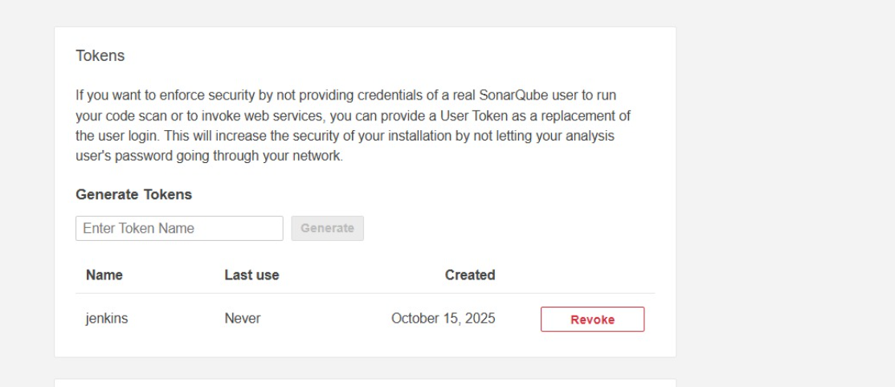
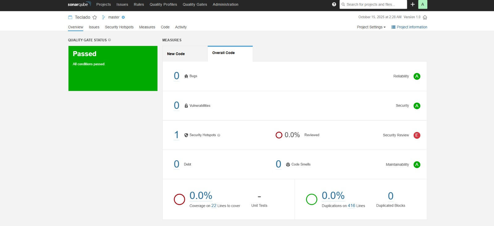
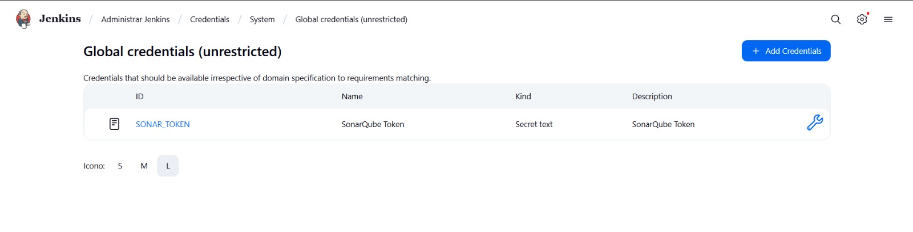
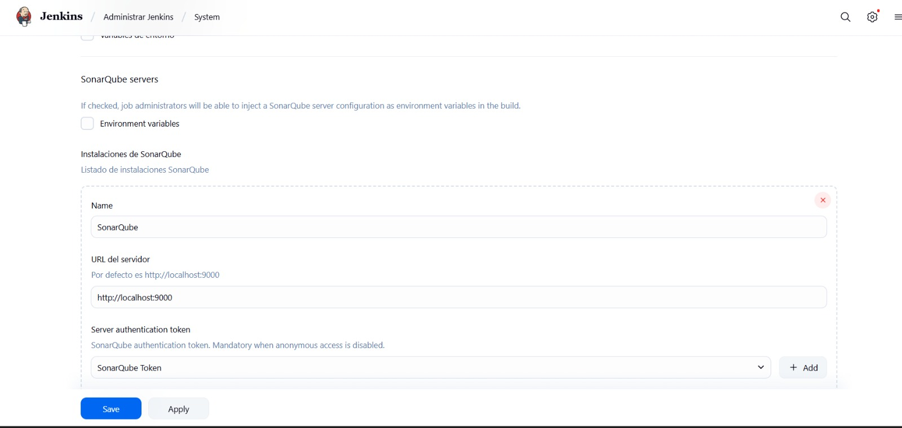
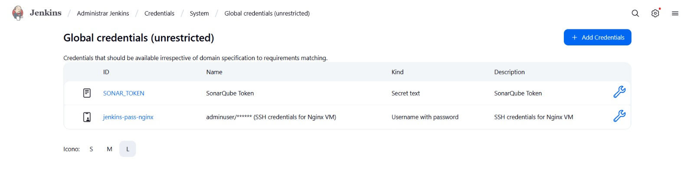
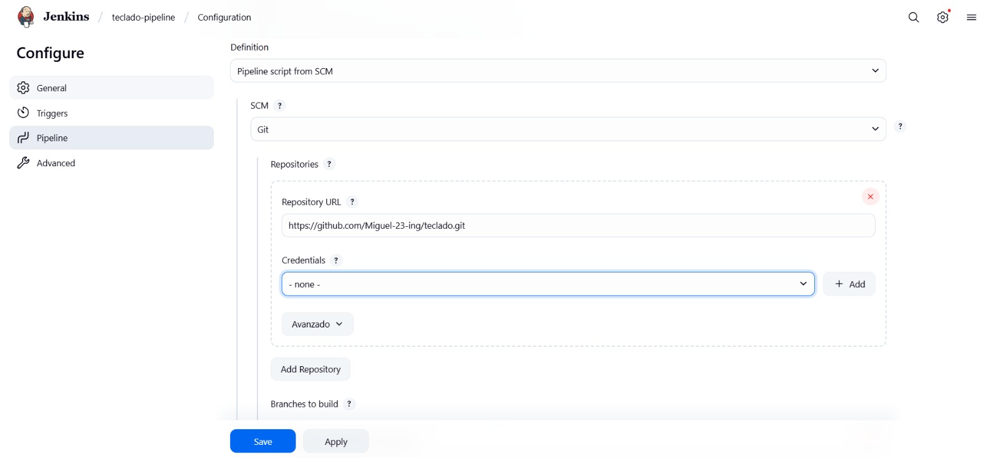
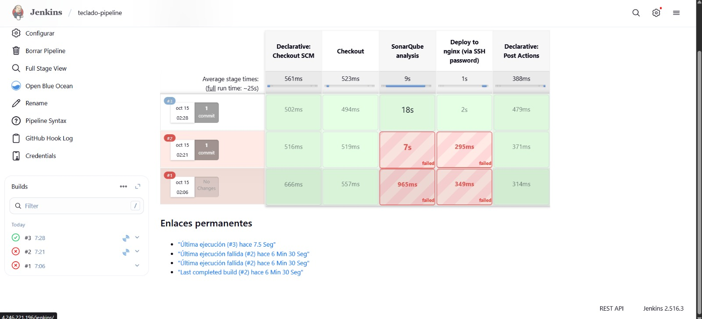
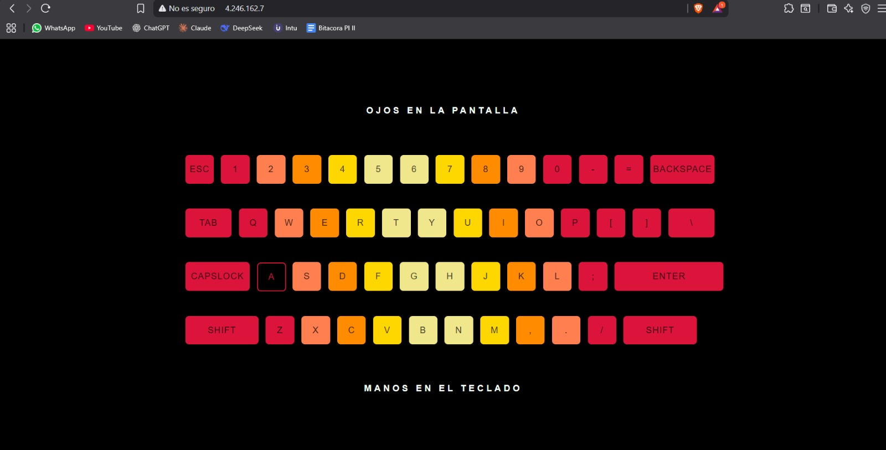

# 🚀 Ansible Pipeline - Stack DevOps CI/CD# ansible-pipeline


## Descripción del Proyecto
Este proyecto implementa un pipeline completo de CI/CD para la aplicación web **"Teclado"** (un teclado virtual interactivo), utilizando una arquitectura distribuida en Azure con las siguientes tecnologías:

- 🔧 **Ansible**: Automatización de infraestructura y despliegues
- 🐳 **Docker & Docker Compose**: Contenedorización de servicios
- 🏗️ **Jenkins**: Servidor de integración continua
- 🔍 **SonarQube**: Análisis estático de código y calidad
- 🌐 **Nginx**: Proxy reverso para gestión de tráfico
- ☁️ **Azure**: Infraestructura en la nube (2 VMs)

---

## 🏗️ Arquitectura del Stack DevOps

### Topología

```
┌─────────────────────────────────────────┐
│  VM Nginx (4.246.162.7)                │
│  ┌────────────────────────────────┐    │
│  │  Nginx Proxy Reverso           │    │
│  │  Puerto: 80                    │    │
│  └────────────────────────────────┘    │
│         │                               │
│         │ Proxy /jenkins/ → 4.246.221.196:80
│         │ Proxy /sonar/   → 4.246.221.196:9000
└─────────────────────────────────────────┘
         │
         ▼
┌─────────────────────────────────────────┐
│  VM Jenkins (4.246.221.196)            │
│  ┌────────────────────────────────┐    │
│  │  Docker Compose Stack          │    │
│  │  ┌──────────────────────────┐  │    │
│  │  │ Jenkins                  │  │    │
│  │  │ Puerto: 80 → 8080        │  │    │
│  │  │ Contexto: /jenkins       │  │    │
│  │  └──────────────────────────┘  │    │
│  │  ┌──────────────────────────┐  │    │
│  │  │ SonarQube                │  │    │
│  │  │ Puerto: 9000             │  │    │
│  │  └──────────────────────────┘  │    │
│  │  ┌──────────────────────────┐  │    │
│  │  │ PostgreSQL               │  │    │
│  │  │ Puerto: 5432             │  │    │
│  │  └──────────────────────────┘  │    │
│  └────────────────────────────────┘    │
└─────────────────────────────────────────┘
```

---

## 🌐 URLs de Acceso

### A través del Proxy Nginx (Futuro - Requiere configuración)
- **Jenkins**: http://4.246.162.7/jenkins/
- **SonarQube**: http://4.246.162.7/sonar/
- **Aplicación Teclado**: http://4.246.162.7/

### Acceso Directo (Actual)
- **Jenkins**: http://4.246.221.196
- **SonarQube**: http://4.246.221.196:9000 (interno)
- **Aplicación Teclado**: http://4.246.162.7

---

## 📁 Estructura de Archivos

```
ansible-pipeline/
├── docker-compose.yml          # Stack Docker (Jenkins, SonarQube, PostgreSQL)
├── Dockerfile.jenkins          # Imagen personalizada Jenkins Alpine
├── plugins.txt                 # Plugins de Jenkins preinstalados
├── inventory.ini               # Inventario de VMs Azure
├── playbook.yml                # Playbook principal Ansible
├── requirements.txt            # Dependencias Python
├── PROBLEMAS_SOLUCIONADOS.md   # Documentación de problemas resueltos
├── templates/
│   └── nginx-base.conf.j2      # Configuración Nginx con proxy reverso
└── vars/
    └── main.yml                # Variables (IPs, puertos)
```

---

## ⚙️ Variables del Proyecto

Archivo: `vars/main.yml`

```yaml
jenkins_host: "4.246.221.196"     # IP VM Jenkins
jenkins_port: 80                   # Puerto Jenkins
sonar_host: "4.246.221.196"       # IP SonarQube
sonar_port: 9000                   # Puerto SonarQube
nginx_port: 80                     # Puerto Nginx
```

---

## 🛠️ Componentes Desplegados

### VM Jenkins (4.246.221.196)
**Contenedores Docker Compose:**

- **Jenkins**: `jenkins-custom:latest` (Alpine + JDK 17)
  - Puerto: 80 → 8080
  - Plugins: Git, SonarQube, Docker, BlueOcean, SSH Agent
  - Tools: Node.js, SonarQube Scanner 5.0.1, sshpass, rsync

- **SonarQube**: `8.2-community`
  - Puerto: 9000
  - Análisis de calidad de código

- **PostgreSQL**: `12-alpine`
  - Base de datos para SonarQube

### VM Nginx (4.246.162.7)
- Nginx nativo en Ubuntu 16.04
- Proxy reverso para Jenkins y SonarQube
- Hosting de aplicación Teclado en `/var/www/html`

---
## 📝 Problemas Resueltos

### 1. ⚠️ **Error 137 - SonarQube Elasticsearch Memory**

**Problema:** Error 137 en SonarQube - Elasticsearch se cerraba por falta de memoria

**Causa:** Elasticsearch requería más memoria de la disponible en la VM

**Síntoma:** 
```
Process exited with exit value [es]: 137
ERROR: [1] bootstrap checks failed
[1]: initial heap size [268435456] not equal to maximum heap size [536870912]
```

**Solución:** Optimización de memoria en `docker-compose.yml`

```yaml
sonarqube:
  environment:
    - sonar.search.javaOpts=-Xms256m -Xmx256m -XX:+DisableExplicitGC
    - sonar.ce.javaOpts=-Xmx256m
    - sonar.web.javaOpts=-Xmx256m
```

**Explicación:** Reducimos la memoria de Elasticsearch a 256MB con heap sizes iguales (-Xms256m -Xmx256m) y deshabilitamos garbage collection forzado (-XX:+DisableExplicitGC) para evitar conflictos de memoria.

### 2. ⚠️ **Ansible Playbook**: Error intencional (focal vs xenial repositories)

### 3. ⚠️ **Memoria Limitada**: Optimización con Alpine Linux (595MB vs >800MB)

### 4. ⚠️ **GPG Key Errors**: Cambio de Debian jdk17 a Alpine base

### 5. ⚠️ **Java Module System**: Flags JVM para SonarQube Scanner con Java 17

### 6. ⚠️ **JavaScript Analysis**: Instalación de Node.js 20.x

---

## 🚀 Pipeline CI/CD

### Flujo Automatizado

```
1. Developer → git push main
2. GitHub → Webhook → Jenkins
3. Jenkins ejecuta:
   ├─ Checkout código
   ├─ SonarQube análisis
   └─ Deploy a Nginx (SSH)
```

### Jenkinsfile

```groovy
pipeline {
  agent any
  
  environment {
    SONAR_HOST_URL = 'http://sonarqube:9000'
    SONAR_TOKEN = credentials('SONAR_TOKEN')
  }
  
  stages {
    stage('Checkout') { ... }
    stage('SonarQube analysis') { ... }
    stage('Deploy to nginx (via SSH password)') { ... }
  }
}
```

---

## 📦 Instalación y Configuración

### 1. Desplegar con Ansible

```bash
# Desde WSL Ubuntu
cd "/mnt/c/Users/Miguel Angel/Documents/Ingesoft 5/Jenkins/ansible-pipeline"

# Ejecutar playbook completo
ansible-playbook -i inventory.ini playbook.yml

# Solo Nginx
ansible-playbook -i inventory.ini playbook.yml --tags nginx

# Solo Jenkins/Docker
ansible-playbook -i inventory.ini playbook.yml --tags jenkins
```

### 2. Configurar Jenkins

```bash
# Obtener password inicial
ssh adminuser@4.246.221.196
docker exec jenkins cat /var/jenkins_home/secrets/initialAdminPassword
```

**Configurar en UI:**
1. Manage Jenkins → System
2. Jenkins URL: `http://4.246.221.196/jenkins/`
3. SonarQube Server:
   - Name: `SonarQube`
   - URL: `http://sonarqube:9000`
   - Token: (credential `SONAR_TOKEN`)


## 🔧 Configuración Manual Post-Despliegue

### Paso 1: Configurar SonarQube

#### 1.1 Acceder a SonarQube
- URL: `http://4.246.221.196:9000`
- Usuario: `admin`
- Contraseña: `admin`

#### 1.2 Cambiar contraseña (Primera vez)
- SonarQube pedirá cambiar la contraseña
- Nueva contraseña: `DevOps2025!@#`



#### 1.3 Generar Token para Jenkins
1. Click en avatar (arriba derecha) → **"My Account"**
2. Pestaña **"Security"**
3. En **"Generate Tokens"**:
   - **Name:** `Jenkins`
   - **Type:** `Global Analysis Token`
   - **Expires in:** `No expiration`
   - Click **"Generate"**
4. **⚠️ COPIAR EL TOKEN** (solo aparece una vez): `squ_xxxxx...`

#### 1.4 Crear Proyecto
1. Home → **"Projects"** → **"Create Project"** → **"Manually"**
2. Configurar:
   - **Project key:** `teclado`
   - **Display name:** `Teclado`
   - **Main branch:** `main`
3. Click **"Set Up"**



---

### Paso 2: Configurar Jenkins

#### 2.1 Agregar Token de SonarQube como Credencial



1. **Manage Jenkins** → **"Manage Credentials"**
2. Click **"System"** → **"Global credentials (unrestricted)"**
3. **"Add Credentials"**:
   - **Kind:** `Secret text`
   - **Scope:** `Global`
   - **Secret:** `[pegar token de SonarQube]`
   - **ID:** `SONAR_TOKEN`
   - **Description:** `SonarQube Token`
4. Click **"Create"**

#### 2.2 Configurar SonarQube Server en Jenkins



1. **Manage Jenkins** → **"Configure System"**
2. Buscar **"SonarQube servers"**
3. Click **"Add SonarQube"**:
   - **Name:** `SonarQube`
   - **Server URL:** `http://sonarqube:9000`
   - **Server authentication token:** Seleccionar `SONAR_TOKEN`
4. Click **"Save"**

#### 2.3 Configurar Herramienta SonarQube Scanner

1. **Manage Jenkins** → **"Global Tool Configuration"**
2. Buscar **"SonarQube Scanner"**
3. **"Add SonarQube Scanner"**:
   - **Name:** `SonarQubeScanner`
   - **Install automatically:** ✅ Marcado
   - **Version:** `SonarQube Scanner 7.3.0.5189`
4. **"Save"**

#### 2.4 Agregar Credenciales SSH para Nginx



1. **Manage Jenkins** → **"Manage Credentials"** → **"Global credentials"**
2. **"Add Credentials"**:
   - **Kind:** `Username with password`
   - **Username:** `adminuser`
   - **Password:** `DevOps2025!@#`
   - **ID:** `jenkins-pass-nginx`
   - **Description:** `SSH credentials for Nginx VM`
3. Click **"Create"**

---

### Paso 3: Crear Pipeline Job



#### 3.1 Crear Nuevo Pipeline
1. Jenkins Home → **"New Item"**
2. **Item name:** `teclado-pipeline`
3. Seleccionar **"Pipeline"**
4. Click **"OK"**

#### 3.2 Configurar Pipeline
**Build Triggers:**
- ✅ **"GitHub hook trigger for GITScm polling"**

**Pipeline:**
- **Definition:** `Pipeline script from SCM`
- **SCM:** `Git`
- **Repository URL:** `https://github.com/Miguel-23-ing/teclado.git`
- **Branch Specifier:** `*/main`
- **Script Path:** `Jenkinsfile`

**Save**

---

### Paso 4: Configurar GitHub Webhook

#### 4.1 En GitHub
1. Ir al repositorio: `https://github.com/Miguel-23-ing/teclado`
2. **Settings** → **Webhooks** → **"Add webhook"**

#### 4.2 Configurar Webhook
- **Payload URL:** `http://4.246.221.196/jenkins/github-webhook/`
- **Content type:** `application/json`
- **Which events would you like to trigger this webhook?:** `Just the push event`
- **Active:** ✅ Marcado
- **Secret:** (dejar vacío)

**Add webhook**

---

### Paso 5: Ejecutar Primer Build



#### 5.1 Build Manual
1. En Jenkins → **"teclado-pipeline"** → **"Build Now"**
2. Click en el número de build (#1)
3. **"Console Output"** para ver logs

#### 5.2 Verificar Etapas
- ✅ **Checkout** - Descarga código
- ✅ **SonarQube analysis** - Analiza código
- ✅ **Deploy to nginx** - Despliega aplicación

---

### Paso 6: Verificar Despliegue



#### 6.1 Acceder a la Aplicación
- **URL:** `http://4.246.162.7/`
- Debería mostrar el **Teclado Virtual**

#### 6.2 Ver Análisis en SonarQube
- **URL:** `http://4.246.221.196:9000/projects`
- Ver proyecto **"teclado"** con resultados

---

## 🎯 URLs de Acceso Final

| Servicio | URL | Descripción |
|----------|-----|-------------|
| 🎹 **Aplicación Teclado** | `http://4.246.162.7/` | App desplegada |
| 🔧 **Jenkins** | `http://4.246.221.196/jenkins/` | CI/CD Server |
| 📊 **SonarQube** | `http://4.246.221.196:9000/` | Análisis de código |

## 🔧 Comandos Útiles

### Docker
```bash
# Ver contenedores
docker ps

# Logs
docker logs -f jenkins
docker logs -f sonarqube

# Reiniciar
docker-compose restart
```

### Nginx
```bash
# Verificar configuración
sudo nginx -t

# Recargar
sudo systemctl reload nginx

# Ver logs
sudo tail -f /var/log/nginx/access.log
```

### SonarQube
```bash
# Estado interno
curl http://localhost:9000/api/system/status

# Ver proyectos
curl -u admin:admin http://localhost:9000/api/projects/search
```

---

## 🎯 Credenciales

| Servicio | URL | Usuario | Contraseña |
|----------|-----|---------|------------|
| Jenkins | http://4.246.221.196 | admin | (ver logs iniciales) |
| SonarQube | http://4.246.221.196:9000 | admin | admin |
| VM Jenkins | SSH: 4.246.221.196 | adminuser | DevOps2025!@# |
| VM Nginx | SSH: 4.246.162.7 | adminuser | DevOps2025!@# |

---

## 🛡️ Troubleshooting

### SonarQube no responde
```bash
docker logs sonarqube | grep "SonarQube is up"
docker-compose restart sonarqube
```

### Pipeline falla en Deploy
```bash
# Probar SSH manual
sshpass -p 'DevOps2025!@#' ssh adminuser@4.246.162.7 'echo OK'

# Verificar credenciales en Jenkins
```

### Jenkins no arranca
```bash
docker logs jenkins
# Verificar memoria disponible
free -h
```

---

## 👥 Equipo

**Miguel Angel** - Ingeniería de Software V
**Daron Mercado** - Ingeniería de Software V

---

## 📄 Licencia

Proyecto académico - Universidad
